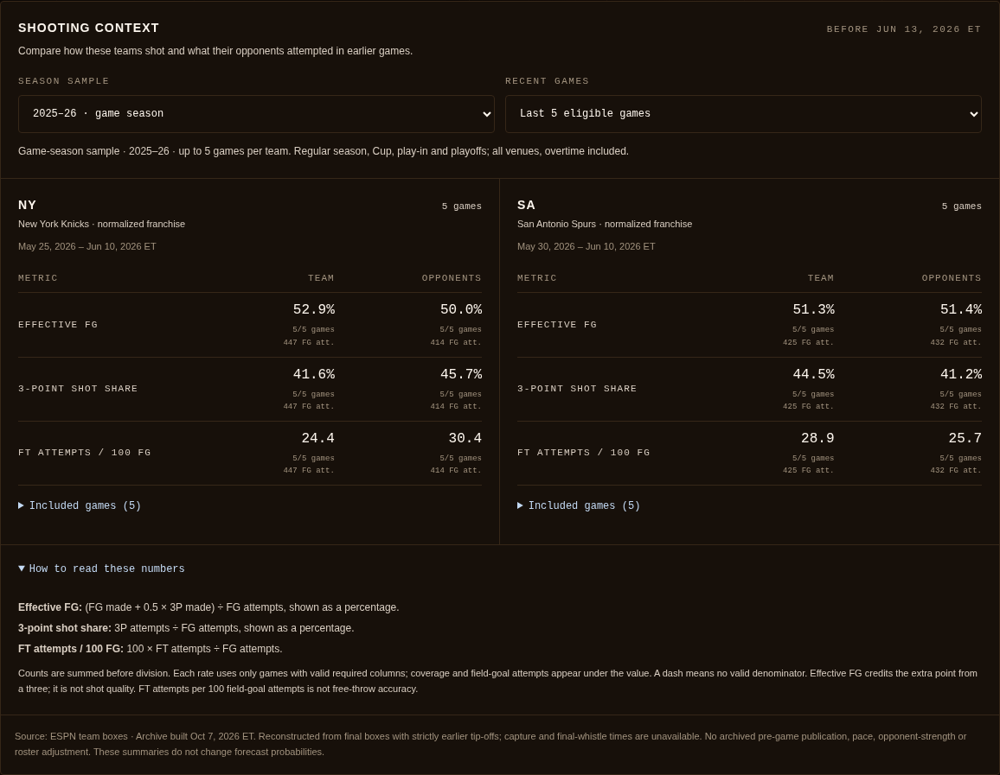
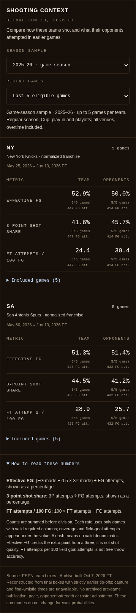

# Dated team shooting context

This adds a new reading aid to franchise game pages after the single-game player
comparison in PR #6. A reader can compare recent team offense and opponent
shooting, switch between 5 and 10 games, inspect coverage and open every included
result. It uses the committed ESPN team archive; it does not collect a player
season corpus or train a new model.

## Scope and temporal boundary

- The selected game and every equal or later tip-off are excluded. Only regular
  season/Cup, play-in and playoff results within the selected season qualify.
  Preseason and All-Star events are excluded. Venue is not filtered; overtime is
  retained and marked on the result links.
- The game-season sample is the default. A missing season file is visible, with
  an explicit button to view the prior-season reference. Prior-season data is
  never silently substituted into a current-season sample. The 2026–27 season
  has no committed results archive yet; the button opens a labeled 2025–26 sample.
- Normalized warehouse franchise IDs orient home and away boxes. Historical
  franchise labels are described as normalized; no historical player roster or
  actual game-reported team name is reconstructed from today's teams.
- Final boxes are reconstructed now. The archive has tip-off dates, not final
  whistle times or independently recorded pre-game publication/capture times.
  An earlier tip-off is the filter, not proof of information availability then.
  The archive compilation date is shown separately from the game cutoff.
- No pace, opponent-strength, roster or venue adjustment is made. These are
  descriptive team samples, not player talent, expected shot quality, fantasy
  output, career/season player averages or monetary player values. Rates do not
  change or explain the forecast probabilities. A 5/10-game window is small and
  its coverage is not a confidence interval.

## Calculations and missingness

Effective FG = (FGM + 0.5 × 3PM) / FGA. Three-point share = 3PA / FGA.
FT attempts per 100 FG attempts = 100 × FTA / FGA.
[NBA definitions](https://www.nba.com/stats/help/glossary) provide the reference.

For each team and its opponents, valid required counts are summed before
division. These are attempt-weighted rates, not the average of game percentages.
Each metric has its own valid-game count and FGA denominator. Missing, negative,
non-integer, impossible made/attempted lines or zero denominators cannot create
a valid rate. Legitimate zero attempts/makes stay zero; eFG can exceed 100% and is
not clamped. Missing columns do not pull older games into the window to conceal
a coverage gap. The window is the last eligible results, even with partial boxes.

The server reads at most two season files. Only each team's bounded summaries
and included-game references reach the client; no season file or forecast array
is passed to the new client component. Native controls update `scoutSeason` and
`scoutWindow` while retaining existing player-comparison query parameters. A
small Suspense query observer and popstate listener restore cached navigation,
shared URLs, reload, Back and Forward. Included-game links disable speculative
prefetch to avoid unnecessary archive summary requests.

## Reel reference review

The public [grandngom/xG-model-football](https://github.com/grandngom/xG-model-football/tree/c992f0335ddecc281c211dda062132808868fb3f)
was reviewed at commit `c992f0335ddecc281c211dda062132808868fb3f` (May 22, 2026).
Its [MIT license](https://github.com/grandngom/xG-model-football/blob/c992f0335ddecc281c211dda062132808868fb3f/LICENSE)
requires retaining the notice for copied/substantial code. No code, data or model
from it is incorporated here. Existing Next/React components and the basketball
archive supply the implementation; no dependency was added.

The README describes an educational StatsBomb soccer sample of about 50 matches,
1,390 shots and 166 goals. Player/team analysis is listed as future work.
Its [main evaluation](https://github.com/grandngom/xG-model-football/blob/c992f0335ddecc281c211dda062132808868fb3f/main.py)
splits shot rows randomly rather than grouping matches or future time periods;
the headline evaluations use full-data probabilities, including training rows.
Held-out ROC is computed later. The bootstrap resamples individual labels and
predictions without match clustering or refitting. Those results do not establish
future basketball performance. Soccer pitch geometry, goal labels and xG
coefficients cannot be transferred to NBA field goals. The gated resource bundle
was not obtained; a reel is not evidence of working production models.

The useful adaptation is contextual evidence with inspectable samples. Any
future predictive challenger still needs whole-game chronological holdouts,
serving-time feature availability, named baseline/market comparisons and measured
calibration before affecting a published probability. No accuracy gain is claimed
for this descriptive feature.

## Verification

Base: current main `a574334bb5ba1bf4b4562335d48a187ae2084e8b`, including PR #6.
All work uses the saved cloud environment. Older local branches are preserved.
No backend data, workflow, credentials, paid service or production job is changed.

- Lint and TypeScript passed. All 266 frontend tests passed; 11 new tests cover
  weighted denominators, orientation, missing/invalid counts, overtime/phases,
  explicit prior-season scope and query restoration. Real 2026 archive checks
  across regular season, play-in and playoffs confirm that mutating the selected
  and later games cannot change the summaries. Both season scopes remain below
  a 20 KB serialization bound in those cases. The production build completed
  all 504 static pages. No backend/model code changed.
- Actual Chromium checked the unmodified production build at 320, 390, 768 and
  1440 px: native keyboard selection/focus, repeated scope/window changes,
  shared URLs, reload, Back/Forward, included-game links and contextual Back,
  section-jump focus without extra history, game-season empty recovery and
  explicit prior-season reference. Reduced motion, horizontal overflow and axe
  WCAG 2 A/AA were checked. No overflow, unexpected page errors or violations
  occurred. Screenshots were visually inspected.
- Real 2016 game `400828031` verifies partial coverage (8/10 for Golden State,
  8/9 for Brooklyn) without zero-filling or extending the sample. A first game
  of 2026 verifies a legitimate empty earlier-game sample. ESPN responses were
  controlled to HTTP 503 throughout: stored team context still renders while
  the existing player box-score unavailable state stays honest.
- An isolated temporary development route exercised the actual shared loading
  and error boundaries at 320, 390 and 1440 px. The reduced-motion skeleton,
  keyboard retry and successful recovery to the product GamePage passed. These
  controlled routes and links are absent from the product tree.
- Full-page accessibility checks found an existing period table that could
  scroll on a phone without keyboard focus. Game-period, team-total and fallback
  box-score scroll containers now have labeled focusable regions; the repeated
  audit passed. The new shooting tables fit the page without horizontal scroll.
- For upcoming `/games/401909088`, the actual response contains 8,512 bytes of
  shooting-context client data, 80,317 HTML bytes and 40,429 RSC bytes,
  uncompressed. There are zero unrelated forecast IDs. These are bounded payload
  measurements, not speed or model-accuracy claims.

[Machine-readable report](shooting-context-qa-2026-10-08.json) records widths,
flows, controlled states and response measurements.




[Prior-season reference](screenshots/shooting-context-prior-season.png) ·
[Missing game-season archive](screenshots/shooting-context-empty.png) ·
[Partial source coverage](screenshots/shooting-context-partial.png) ·
[Controlled loading](screenshots/shooting-context-loading.png) ·
[Controlled error](screenshots/shooting-context-error.png).

Reproduce the production interaction audit with a built app on `QA_BASE` and an
isolated boundary fixture on `QA_FIXTURE_BASE`:

```sh
QA_COPY=/tmp/nba-shooting-context-new-fixture node scripts/qa/prepare_shooting_context.mjs
QA_BASE=http://127.0.0.1:3180 QA_FIXTURE_BASE=http://127.0.0.1:3181 node scripts/shooting_context_audit.mjs
```

The helper refuses to overwrite an existing `/tmp` directory. Run the copy with
the existing `scripts/qa/player_profile_fixture.cjs` preload and its
`qa-unavailable-mode` file, which controls ESPN responses to HTTP 503. No new
player feed or credentials are needed. The fixture's only extra route delegates
to the product GamePage, delays rendering and conditionally fails via a local
flag. Its loading UI reuses the product game loader, and errors use the shared
app boundary. The extra route/link exist only in that temporary copy.

Live provider success and public deployment browser access were not verified.
Local Chromium with actual archive data provides this UI evidence; the known
public deployment/proxy restriction was not retried or bypassed. No expensive
training, paid API, new dependency or credential was used. No workflow was
manually dispatched, and no merge was performed. The draft PR awaits independent
review before merge.
