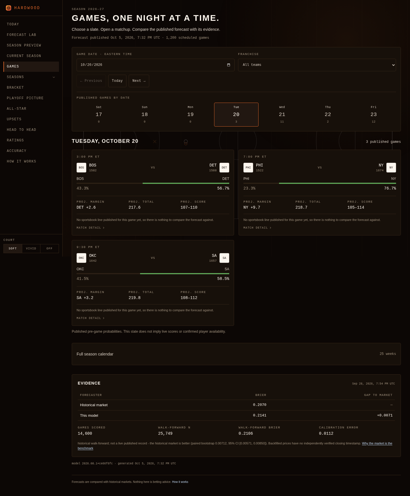
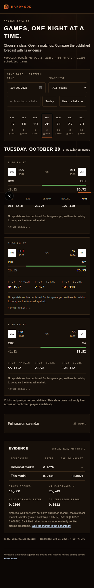
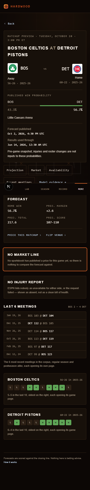

# Daily slate and matchup browsing

The Games page leads with one Eastern-time slate. The date rail, native date
picker, previous/next published slate and franchise filter share their selection
in `?date=YYYY-MM-DD&team=CODE`. Browser history restores those selections. An
empty day offers the next published slate without inventing a game or score.
Phone controls stack, navigation stays on one row and the date rail labels its
published-game counts.

Game cards open the existing matchup route. Upcoming headers show full team
names, season-labelled records, published win probabilities, venue, publication
time and results cutoff. The preview renders on the server with scalar timestamp
props. Focused section navigation is a small client island; it receives
no forecast data. Existing logo fallbacks and contextual Back controls remain
interactive. The Games index retains the schedule needed for local browsing.

Section links move keyboard focus without adding history entries, so Back
returns to the selected date and franchise. Back controls subscribe to the
navigation stack: production rendering exposed an effect-order race where the
control checked history before the shell recorded the visit. Cold game links
still point to the correct Eastern-day parent.

Weekly calendars mount only when expanded. Historical evidence remains visible,
and market/availability gaps remain explicit. Historical market comparisons do
not imply independently verified closing timestamps. Stored scores, sample
counts and forecast probabilities are unchanged.

The [NBA games calendar](https://www.nba.com/games) informed date-first browsing.
Hardwood retains its original walnut surfaces, hairlines, numeric typography and
semantic colours. Team-mark plates now use warm cream rather than pure white,
following the requested restrained product direction while preserving the dark
theme and NBA identity. No external UI code or runtime dependency was added.

## Verification — October 6, 2026

All work and local checks ran in the saved cloud environment. Current main
`d021f351a72a9589e872965118b8846118a4c4bc` was merged into the existing PR branch,
retaining its security updates, ingestion guards and October 5 forecast artifact.
No backend, workflow, dependency or forecast changes are introduced against main.

- Lint and TypeScript passed; 203 frontend tests and 353 backend tests passed.
  The production build completed all 504 static pages. The original four slate
  regressions retain their frozen opening-night rows; ten additional cases cover
  header timing, unknown cutoffs, section focus/history, loading, server-response
  retry, the Back-control effect-order race and same-path query navigation.
- Chromium checks against the production server passed at 320, 390, 768 and
  1440 px: native date selection, Today, the date rail, previous/next published
  slates, franchise filtering, previous history and
  forward restoration, keyboard game navigation, section focus, contextual Back,
  matchup Forward, empty recovery, weekly expansion and unknown-game recovery.
  No page overflow or unexpected browser errors occurred. Axe WCAG 2 A/AA
  checks found zero violations in the slate and matchup content at each width. Full-page captures
  were inspected. ESPN logo failures retained readable franchise fallbacks.
- Controlled temporary development routes exercised Next's actual loading and
  error boundaries at 320 px. A five-second response showed the loading status
  and responsive skeleton. A deliberate server error exposed that resetting the
  boundary alone reused its failed response. Retry now refreshes that response,
  shows a pending state and recovered after the deliberate failure was removed.
  Those fixture routes were removed before the final build.
- For `/games/401909088`, the development HTML fell from 941,908 to 125,391
  uncompressed bytes after removing a 740,826-byte serialized forecast object.
  Unrelated forecast IDs fell from 1,199 to zero. The final production response
  measured 66,015 HTML bytes and 31,533 RSC bytes, with zero unrelated forecast
  IDs in either response. These are payload measurements, not timing benchmarks.

Machine-readable evidence: [slate-qa-2026-10-06.json](slate-qa-2026-10-06.json).
Exact-head remote checks are linked in [draft PR #2](https://github.com/roni-altshuler/nba_predictor/pull/2).

To repeat the production slate and serialization audit, start the built app and
run `node scripts/slate_audit.mjs`. Optional `QA_BASE`, `QA_OUT` and `QA_BROWSER`
select the local URL, screenshot directory and installed Chromium executable.

## Same-path navigation follow-up

Independent review requested the sequence `/games?date=2026-10-21&team=BOS`
→ app Games link → Back → Forward. A cold link stayed correct. After selecting
that same date and franchise through the controls, the cached Next Link changed
the URL to `/games` while the mounted slate still showed October 21/BOS, on both
390 px and 1440 px. The old effect watched only `popstate` and forecast-prop
changes, neither of which the cached link required.

A small query observer now subscribes to Next's search parameters, inside a null
Suspense boundary so the slate's initial game links still render on the server.
The existing native-history listener remains. The mobile More menu also closes
when its link is clicked, including a navigation that keeps the same pathname.
The new regression holds the forecast props stable and updates the query without
`popstate`; browser QA covers both cold and control-based arrival followed by
Games/Back/Forward. The permanent audit adds cached same-path navigation at all
four widths and asserts that the initial game links remain server-rendered.

[Before/after query-state evidence](slate-same-path-qa-2026-10-06.json) records
the exact URLs and visible filters at every step.
[Desktop after Games navigation](screenshots/same-path-desktop.png) ·
[Mobile after Games navigation](screenshots/same-path-mobile.png).

## Remaining coverage and model work

Active-game polling and a successful injury-feed response were not established
by these checks. The upcoming game showed the existing missing-availability
state. The weekly benchmark runner is a separate issue; no workflow was dispatched.

This changes browsing, not forecasting. No forecast was regenerated and no model
accuracy gain is claimed. Injury/roster coverage, prospective evaluation, horizon
cohorts and calibration evidence remain separate measured work. The PR stays a
draft for independent review; nothing was merged or deployed to production.
