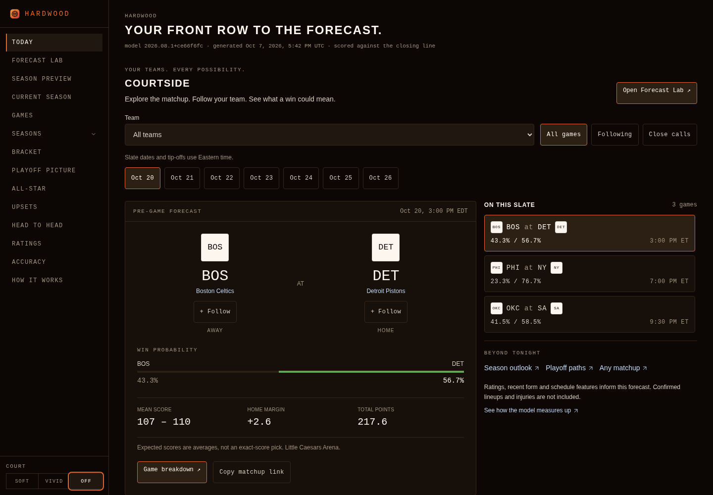

# Hardwood theme across the full journey

The October 8 audit started from main
`5bb550c43446ce24f594b8e6a85294a7294241b3`, including the player profile,
comparison and dated shooting-context features. The original palette was
already coherent: walnut page/card surfaces, cream logo plates, orange chrome,
sans-serif headings and monospace controls/numbers. Hardwood intentionally has
one dark theme. System light/dark preferences do not switch that identity.

## Verified fixes

- Native selects inherited the browser's default scheme while only the slate
  date picker declared dark mode. The root now declares `color-scheme: dark`;
  the date picker inherits it with every other native control.
- A saved Court `off`/`vivid` preference applied to the court before paint, but
  the server-rendered dial highlighted `soft` until hydration. The pre-paint
  root attribute now controls both highlights. The group defers its pressed
  announcement until the client knows the preference, so its server and initial
  client markup agree. The three choices and existing storage key are unchanged.
  If a recreated root loses the attribute, subscribing dials restore the saved
  preference and notify the canvas without changing storage.
- Inline links in prose, footer copy and a team section heading depended on
  color alone. Persistent underlines now provide a visible non-color cue.
- Small red negative/miss labels on archive and methodology pages used ink
  with about 3.73:1 contrast on walnut cards. Those labels now use the existing
  brighter `--accent-loss-soft` token. Large outcome numbers and validated
  chart/fill colors retain their existing tokens.
- Four comparison tables on the accuracy page could scroll on narrow phones
  without keyboard focus. Their containers now have descriptive region names
  and keyboard focus, using the existing focus ring.
- Four homepage text links showed missing-font boxes in place of decorative
  arrows in cloud Chromium. Small SVG marks retain the same cue without a
  font dependency and are hidden from the accessible link names.
- Reaching the actual archive series page exposed overlapping score and
  quarter text at 390 and 768 px. Mobile rows now put game/date/probability,
  the score and quarter totals on separate lines. Wider rows reserve enough
  room for the score before wrapping. Team-name links can truncate inside
  the header while retaining their full accessible names. Browser text-range
  checks found no collisions at 320, 390, 640, 768 or 1440 px after the fix.

No model, forecast, archive, ingestion, workflow, dependency or access setting
is changed. This improves readability and preference consistency; it makes no
claim about prediction accuracy or performance.

## Connected browser verification

The saved cloud environment ran actual Chromium against production builds at
320, 390 and 1440 px. The 1440 px journey ran under both system color preferences;
320 used light and 390 used dark. Each journey followed links and menus through:

Today → dated/filtered slate and empty recovery → upcoming game → empty shooting
sample and explicit prior-season reference → reload → team → completed game and
player comparison → game profile → contextual Back and browser Forward/Back →
head to head → Forecast Lab → ratings → methodology → accuracy → archive list →
season → playoff series → archive games → current season → bracket → All-Star →
upsets → season preview → playoff picture → bare-profile empty state → unknown
game/404 → schedule recovery → controlled loading → error → keyboard retry.

The original audit at `e64f511` could accept the outgoing page: all four
`archive-games` records still pointed to the season page, as did the 320 px
`archive-series` record. That report did **not** prove those destinations.
Coverage version 2 replaces it. Every transition now waits for its explicitly
expected URL and visible destination heading/content. Snapshots repeat those
assertions and record both the expected destination and the actual URL.

Every recorded state checks the root dark scheme, walnut backgrounds, existing
tokens, native control schemes, heading font/case, horizontal overflow and
full-document axe WCAG 2 A/AA. Keyboard activation checks the Court dial and
retry; an evidence table accepts focus and its `scrollLeft` must move after
ArrowRight whenever it overflows. Shooting
scope/window selections survive reload; comparison pairs survive the profile
round trip and browser history. Court `off` persists across the journey.
The four completed corrected journeys record 124 states; the separate
source-outage state brings the full-document accessibility checks to 125.
The final series-layout source at `bc7dd0427760d2c9628df4dad56945dc2b652f27`
completed that whole set with zero axe violations, document overflow or
unexpected runtime errors. The 320/390 px table scrollers moved from zero
after ArrowRight, and every series row passed its text-bounds check.
The report records all expected console failures separately from unexpected
errors. These completed journeys do not erase the failed repetitions described
below or establish that the intermittent hydration issue is fixed.

Separate cold-load checks delay client scripts and prepopulate stored `off` and
`vivid` choices under a light system preference. They inspect the dial before
hydration, then its pressed announcement after hydration, and sample paint
frames for a stable walnut background and preference. The SSR regression test
also ensures the server never invents a pressed `soft` selection.

The unmodified product production build separately verifies the source-outage
state on a completed game. Product and isolated fixture builds generate all
504 static pages; the fixture adds only its temporary controlled route.
All 268 frontend tests, lint and TypeScript pass.

[Machine-readable results](theme-journey-qa-2026-10-08.json) record each state,
system preference, accessibility result and cold-paint observation.



[Mobile shooting context](screenshots/theme-shooting-mobile.png) ·
[Mobile comparison](screenshots/theme-comparison-mobile.png) ·
[Game profile](screenshots/theme-profile-mobile.png) ·
[Evidence](screenshots/theme-evidence-mobile.png) ·
[Controlled loading](screenshots/theme-loading-mobile.png) ·
[Controlled error](screenshots/theme-error-mobile.png) ·
[Saved Court off before](screenshots/theme-cold-off-before.png) ·
[Saved Court off after](screenshots/theme-cold-off-after.png).

[Archive series](screenshots/theme-archive-series-mobile.png) ·
[Archive results](screenshots/theme-archive-games-mobile.png).

## Evidence and limits

The connected player/comparison journey uses the existing ESPN-only preload
with explicitly synthetic QA Guard/Reserve/Forward lines. Team results,
forecasts and shooting rates use the committed real artifacts. CDN logos are
deliberately unavailable so the original abbreviation fallbacks can settle
before measurements. Acceptance journeys explicitly return HTTP 503 for the
browser scoreboard as well; the outage build controls the ESPN summary reader
to HTTP 503. All contexts, including cold paint, source outage and controlled
root recovery, capture page errors and console warnings/errors with route,
stage, UTC time, stack/location and raw document responses. Diagnostic runs
leave the scoreboard request uncontrolled and retain its cloud certificate
failure. No TLS setting was changed.
These checks establish interaction and theme behavior, not live feed coverage.

The first exploratory 390 px hard profile load triggered React #418 and lost
the root Court attribute. Its collector saved only the message and failing
state. The historical stack, event timestamp and exact event URL were never
captured and cannot be recovered. The profile route is an association from the
failed state, not a reconstructed event URL. Original known conditions and
these missing fields are preserved in the
[investigation record](theme-hydration-investigation-2026-10-08.json), alongside
the unchanged [initial observation](theme-hydration-observation-2026-10-08.json).

New diagnostic runs reproduce the same production #418 signature on main
`5bb550c`, including a control with **no axe injection**. It also occurs on the
PR build. This establishes a pre-existing runtime race, rather than evidence
of a PR-only regression or an axe-only artifact. The exact mismatched element
and trigger remain unknown; it does not prove the cause of the historical
event. A new normal full-journey run also failed at 1440/light during the
shooting-selection reload, with **no artificial script delay**. Its stack,
route, timestamp and failed assertion are retained, and its unvisited later
states are not counted as completed coverage.

The initial, timing-comparison and no-axe control matrices retain every case:

| Production source | Cases | React #418 cases | Lost saved preference |
| --- | ---: | ---: | ---: |
| Main `5bb550c` | 58 | 4 | 4 |
| Reconstructed pre-recovery PR source | 53 | 1 | 1 |
| PR source `e64f511` | 58 | 1 | 0 |

Cases include new contexts, light/dark system settings, soft/off/vivid stored
choices, normal and delayed scripts, navigation, and normal/early axe timing.
The early probe is explicitly earlier than the original audit timing.
Reconstructed source is not the original built chunks. Later targeted runs,
including debugger-instrumented controls, are recorded separately; a clean
repeat is never treated as resolving an earlier failure. Development runs also
found a nonfatal Court `useId`/`aria-labelledby` mismatch on both main and PR
source. It is not proven to cause production #418; four initial development
menu-readiness timeouts are retained rather than silently rerun.

After the series-layout fix, 12 additional final-production cases captured no
#418, lost preference or harness failure. Their nine homepage/navigation cases
retained the uncontrolled ESPN scoreboard certificate error. Twenty separate
debugger-instrumented baseline/final controls captured no #418 and did not
identify a mismatched element; debugger timing makes them unsuitable as proof
that the underlying race is absent.

The missing-attribute guard has unit and controlled-browser coverage and kept
the final saved preference after the observed recovery. It **does not prevent
#418**. Hydration remains an independent review blocker. No dependency upgrade,
blanket warning suppression, merge or manual workflow dispatch is introduced.

Loading and error screenshots use an isolated `/tmp` copy. Its temporary route
delegates to the product game page after a short delay, conditionally fails via
a local flag, and uses the actual game loading/shared error boundaries. The
extra route and team-page test link are absent from the product source/build.

Screenshots are visually inspected; the public deployment/proxy restriction
was not retried or bypassed. Live ESPN success and public browser rendering
remain unverified. No production job or workflow was manually dispatched, and
the draft awaits independent review before merge.

## Reproduce

```sh
QA_COPY=/tmp/nba-theme-new-fixture node scripts/qa/prepare_theme_journey.mjs
```

The helper refuses an existing destination. Build/start that copy with
`NODE_OPTIONS=--require=/workspace/nba_predictor/scripts/qa/game_comparison_fixture.cjs`
and `QA_FIXTURE_MODE_FILE=/tmp/nba-theme-new-fixture/qa-available-mode` on port 3191.
Build/start the unmodified product with the existing `player_profile_fixture.cjs`
preload and a mode file containing `unavailable` on port 3192. Use a fresh build
and free ports for each server; then run:

```sh
QA_BASE=http://127.0.0.1:3191 QA_PRODUCT_BASE=http://127.0.0.1:3192 \
QA_PRODUCT_SOURCE_COMMIT="$(git rev-parse HEAD)" node scripts/theme_journey_audit.mjs
```

The audit writes its full report, raw diagnostics and screenshots under
`/tmp/nba-theme-journey-qa`. The committed report groups repeated deliberate
CDN failures by URL/count and retains all other console and page errors.
The diagnostic runner `scripts/hydration_risk_audit.mjs` accepts `QA_BUILDS`,
`QA_SCENARIOS` and `QA_OUT`; its report retains all failed cases and harness
errors. It is diagnostic and does not report a passing exit status as product
acceptance.
